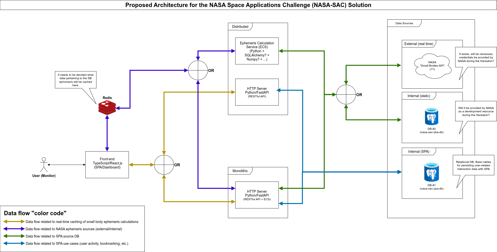

#  1. NASA Space Apps Challenge - Solução da equipe _Cosmobras-48_

Web platform built to monitor potential collisions of celestial bodies with the planet Earth, and also to perform asteroid trajectory simulation. Part of the submission requirements for the aforementioned 2025 Hackaton.

## 1.1. TOC

- [1. NASA Space Apps Challenge - Solução da equipe _Cosmobras-48_](#1-nasa-space-apps-challenge---solução-da-equipe-cosmobras-48)
  - [1.1. TOC](#11-toc)
  - [1.2. Preliminaries](#12-preliminaries)
  - [1.3. Proposed architecture (WiP)](#13-proposed-architecture-wip)
  - [1.4. Project Management](#14-project-management)
    - [1.4.1. Dependency Installation](#141-dependency-installation)
      - [1.4.1.1. Backend](#1411-backend)
      - [1.4.1.2. Frontend](#1412-frontend)
    - [1.4.2. Startup](#142-startup)
    - [1.4.3. Shutdown](#143-shutdown)
  - [1.5. Demos](#15-demos)
  - [1.6. TL;DR](#16-tldr)
  - [1.7. What do you want to do?](#17-what-do-you-want-to-do)

## 1.2. Preliminaries

This project was developed using the following tools:

- Python, version 3.12.9 or higher:
  - UV Package Manager: Consumes the [`pyproject.toml`](./pyproject.toml) and [`uv.lock`](./uv.lock) files to install dependencies. Instructions for installing the manager can be found [here](https://docs.astral.sh/uv/getting-started/installation/);
- Node.js, version 22.13.0 or higher:
- [Node Version Manager (`nvm`)](https://github.com/nvm-sh/nvm): v2.2.17 or higher;
  - [PNPM Package Manager (`pnpm`)](https://pnpm.io/pt/): v10.17.1 or higher;
  -  [Docker Engine](https://docs.docker.com/engine/install/ubuntu/): v28.0.1 or higher:
- [`docker` command without being `sudo`](https://docs.docker.com/engine/install/linux-postinstall/). Optional;
  - [Docker Compose](https://docs.docker.com/compose/install/linux/): v2.29.7-desktop.1 or higher;
  - [GNU Make](https://www.gnu.org/software/make/): v4.3 or higher.

## 1.3. Proposed architecture (WiP)

In the initial deliberation phase, the following architecture was proposed to meet the use cases proposed at the Hackathon:



Ultimately, due to time constraints, varying levels of practical experience among the development team members, and the risk of overengineering, the software platform consists of the following services, orchestrated via Docker Compose and declared in a YML manifesto:

- `backend`: An HTTP application server (backend), written in Python, exposing a RESTful API built using FastAPI;
- `frontend`: A user interface (frontend), written in TypeScript, running on Node.js, using the Vite.js library for building components;
- `database`: A non-relational MongoDB database server;
- `mongo-express`: A service for monitoring and manipulating the database, accessible via the browser (Mongo Express).

> [!IMPORTANT]
> Due to time constraints, the database service was not integrated into the backend to implement the use cases associated with manipulating the asteroid monitoring dashboard (e.g., favoriting cards by user, etc.). In fact, the core of the project (the codebase used to generate the submitted demo) is in the backend;
>
> The frontend user interface is functional, but not integrated with the RESTful API served by the backend, for the same reason.

Below is a schematic representation:


## 1.4. Project Management

### 1.4.1. Dependency Installation

#### 1.4.1.1. Backend

To create the Python virtual environment locally, in the correct version, via UV, run in the terminal:

```bash
cd backend                                  # Go to the backend root
uv python install 3.12                      # Install the correct version of Python
uv venv --python 3.12                       # Create the virtual enviroment in ".venv" folder
source ./venv/bin/activate                  # Activate the enviroment
uv pip install -r pyproject.toml            # Install project dependencies
```

In order to manage packages individually, simply run at the root of the project,

```bash
uv --project backend/pyproject.toml [add | remove] [package-name]           # Install (or remove) a single production package
uv --project backend/pyproject.toml [add | remove] --dev [package-name]     # Install (or remove) a single development package
```

#### 1.4.1.2. Frontend

To create a local installation of Node.js dependencies, simply run the following commands at the project root:

```bash
nvm install lts && npm i -g pnpm@latest     # Install the LTS version of Node.js and the PNPM package manager
pnpm --prefix frontend install              # Install project packages
```

In order to manage packages individually, simply run at the root of the project,

```bash
pnpm --prefix frontend [add | remove] [package-name] # Install (or remove) packages
```

### 1.4.2. Startup

Through `make`, via Docker Compose automation scripts implemented in a [Makefile](./Makefile), at the root of the project. To check the documentation for each script, simply run it in the terminal

```bash
make                                # Without any command, prints documentation (fallback - make help)
make help                           # Prints explicitly the documentation for each command
```

Considering an initial installation, at the root of the project, run the following commands:

```bash
$ make build                                    # Perform imagem building of all services' images, each one at ./infra/docker/[service-name]/Dockerfile
$ make start c=database                         # Start MongoDB container
$ make start c=mongo-express                    # Start Mongo Express service container
$ make start c=frontend                         # Start backend container
$ make start c=backend                          # Start backend container
```

> [!NOTE]
> To ensure that the images were generated by the build process, simply run the `docker image ls` command.
>
> To ensure that the containers were actually started correctly and listening on the correct ports, simply run the `make ps` command.
>
> To view the logs for a specific container, run `make logs c=[service-name]`.

> [!IMPORTANT]
> The RESTful API documentation can be accessed via browser at [`http://localhost:8001/api/docs`](http://localhost:8001/api/docs). >
> Exploratory testing of the RESTful API can be conducted using a Postman collection (JSON file), available at [`./resources/testing`](./resources/testing/cosmobras-48-nasa-sac-api.postman_collection.json).
>
> The user interface in the `frontend` is functional, but not integrated with the RESTful API served by the `backend`.


### 1.4.3. Shutdown

Similarly, for both environments, in order to stop all containers from running, simply run:

```bash
make stop           # Shutdown all containers
make clean          # Optional. Remove all containers and associated networks.
```

## 1.5. Demos

- [YouTube video](https://www.youtube.com/watch?v=ZFDoqMSZjqI): The front-end application, that renders the asteroid monitoring dashboard.


## 1.6. TL;DR

The [Cosmobras-48](https://www.spaceappschallenge.org/2025/find-a-team/cosmobras-48/?tab=members) team is composed of:

- **Damares do Socorro Gonçalves Gaia** (`@damaresgaia`) - frontend
- **Giordano Bruno Ribeiro Chaves Alves** (`@gio_alves`) - backend/simulations/integrations
- **Guilherme Lima Gonçalves** (`@lwglg`) - backend/integrations
- **Henrique de Lima Schweitzer** (`@henrique.schweitzer`) - backend/integrations
- **Vitor Costa Farias** (`@vcfarias` - _Team Owner_) - backend/simulations

Any questions about the project can be asked by contacting them.

---

## 1.7. What do you want to do?

- [Back to top](#11-toc)
