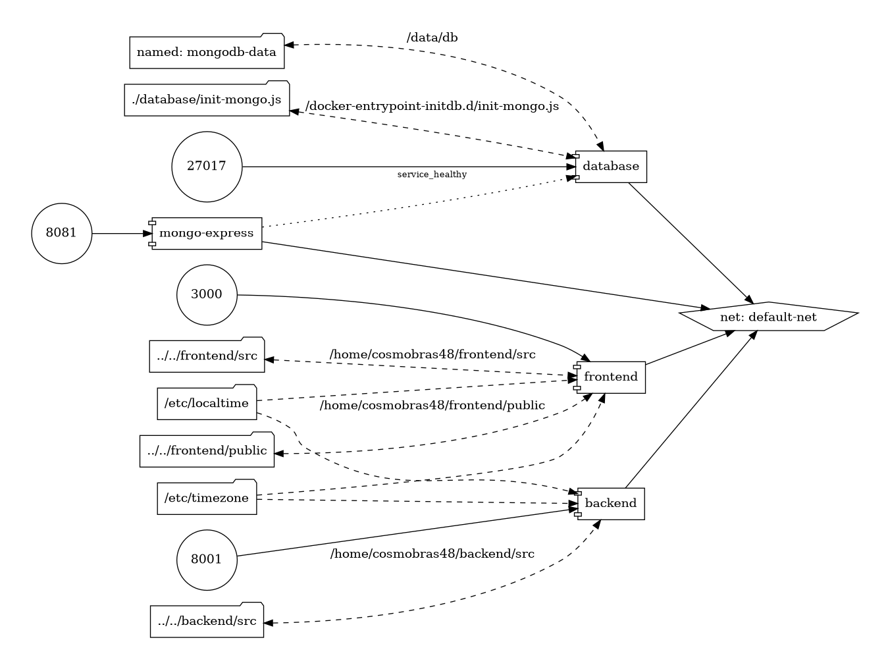

# nasa-space-apps-cosmobras48

## Preliminares

Esse projeto foi desenvolvido utilizando as seguintes ferramentas:


- Python, versão 3.12.9 ou superior; 
- UV Package Manager: Consome os arquivos [`pyproject.toml`](./pyproject.toml) e [`uv.lock`](./uv.lock) para instalar as dependências. Instruções para a instalação do gerenciador encontram-se [aqui](https://docs.astral.sh/uv/getting-started/installation/).
- [Docker Engine](https://docs.docker.com/engine/install/ubuntu/): v28.0.1 ou superior:
    - [Comando `docker` sem ser `sudo`](https://docs.docker.com/engine/install/linux-postinstall/). Opcional;
- [Docker Compose](https://docs.docker.com/compose/install/linux/): v2.29.7-desktop.1 ou superior;
- [GNU Make](https://www.gnu.org/software/make/): v4.3 ou superior.


## Topologia do projeto (WiP)



## Quick reference

### Backend

#### Instalação inicial de dependências

Para criar o ambiente virtual Python localmente, na versão correta, via UV, execute no terminal: 

```bash
cd backend                          # Ir para a raíz correta
uv python install 3.12              # Instala a versão correta do Python
uv venv --pytrthon 3.12             # Cria o diretório ".venv"
source ./venv/bin/activate          # Monta o virtualenv
uv install -r pyproject.toml        # Instala dependência de projeto
```

#### Gerenciamente de dependências

```bash
uv [add | remove] [package-name]            # Instala (ou remove) package de produção
uv [add | remove] --dev [package-name]      # Instala (ou remove) package de desenvolvimento
```
